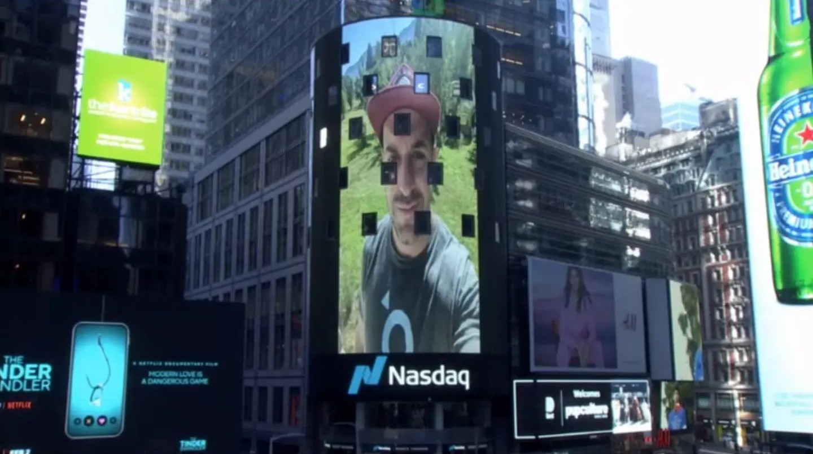

---
hide:
  - navigation
  - toc
---

# Hi!

<figure markdown>
  { align=left}
  <figcaption>That is me on Time Square</figcaption>
</figure>

## Who am I?

My name is Teo Sibileau. This is my [:simple-linkedin: Linkedin](https://www.linkedin.com/in/te%C3%B3filo-sibileau-18800058/).

I'm a python developer with almost 20 years of experience. I've worked on a wide range of projects, from small websites to large scale data processing pipelines.

I'm based near El Bolsón, Río Negro, deep within the Argentinian Andes. I live with my wife and our 8 year old.

<figure markdown>
{ align=left}
<figcaption>Here's a drone pic right above my house</figcaption>
</figure>

My life is split between my family, my work and a many other interests among which: **training and playing rugby, building infrastructure for my farm & everything about the guitar**. I document a lot of this on [:simple-instagram: Instagram](https://www.instagram.com/teosibileau/).

## Code that I can show

I prefer to use [:borrowed-gitlab: Gitlab](https://gitlab.com/users/teosibileau/projects) now, but i have a few projects on [:borrowed-github: Github](https://github.com/teosibileau). Here's a selection:

| Selected Project | Description |
|--|--|
| [bosminer-py](https://gitlab.com/slkmining/bosminer-py) | Python client to retrieve data from any miner running Braiins OS+ Socket API. |
| [antminer-py](https://gitlab.com/slkmining/antminer-py) | Python client to retrieve data from AntMiners stock firmware (reverse engineered) REST API. |
| [media-watchdog](https://gitlab.com/teosibileau/media-watchdog) | Screen a path for updates and publish changes to rabbitmq |
| [Nameko InfluxDB metrics](https://gitlab.com/teosibileau/nameko.influxdb.metrics) | A nameko microservice to write/read to/from influxdb (inspired by Grafana query builder). |
| [Grafane](https://gitlab.com/grafane/grafane) | A very opinionated influxdb client that uses the official python client and is very much inspired in grafana's query builder. |
| [lechuga](https://github.com/teosibileau/lechuga) | Retrieve usd/ars rates from the cli |
| [leaflet.map.zoomToGeometries](https://github.com/teosibileau/leaflet.map.zoomToGeometries.js) | A leaflet plugin to zoom to a geojson geometry |

## Experience

### [Satellogic](https://satellogic.com/) <small>Feb 2019 - Present</small>

Full time remote position at Satellogic, a leading provider of high-resolution satellite imagery to governments and commercial customers worldwide.

#### Responsibilities

+ Django development
+ Designing strategies to speed up plan runs  
+ Implementing monitoring and alert solutions
+ Moving the entire platform from Azure Cloud to AWS.

**Tools:** [Python :fontawesome-brands-python:](https://www.python.org/ "Python")
[Django :borrowed-django:](https://www.djangoproject.com/ "Django")
[Celery :borrowed-celery:](https://docs.celeryproject.org/ "Celery")
[Redis :borrowed-redis:](https://redis.io/ "Redis")
[PostgreSQL :borrowed-postgresql:](https://www.postgresql.org/ "Postgresql")
[RabbitMQ :borrowed-rabbitmq:](https://www.rabbitmq.com/ "Rabbitmq")
[ElasticSearch :borrowed-elastic:](https://www.elastic.co/ "ElasticSearch")
[Docker :borrowed-docker:](https://www.docker.com/ "Docker")
[Kubernetes :borrowed-kubernetes:](https://kubernetes.io/ "Kubernetes")
[Helm :borrowed-helm:](https://helm.sh/ "Helm")
[Azure :borrowed-microsoftazure:](https://azure.microsoft.com/en-us/ "Azure cloud")
[AWS :fontawesome-brands-amazon:](https://aws.amazon.com/ "AWS")

### [Infoxel (Now Seenka)](https://seenka.com) <small>February 2018 - October 2018</small> 

#### [Welo](https://welo.tv/)

Welo is a platform that combines a powerful video editor with a model of distribution and monetization of premium content in news portals.

#### Responsibilities

+ Django development
+ Refactoring clip delivery to acomodate volatility of demand during the 2018 Soccer World Cup
+ Refactoring the company's monolithic video processing pipeline into a series of microservices communicating through google cloud pubsub and sharing data through ElasticSearch indices to help with dynamic scaling based on specific real time needs

**Tools:** [Python :fontawesome-brands-python:](https://www.python.org/ "Python")
[Django :borrowed-django:](https://www.djangoproject.com/ "Django")
[Celery :borrowed-celery:](https://docs.celeryproject.org/ "Celery")
[Redis :borrowed-redis:](https://redis.io/ "Redis")
[ElasticSearch :borrowed-elastic:](https://www.elastic.co/ "ElasticSearch")
[PostgreSQL :borrowed-postgresql:](https://www.postgresql.org/ "Postgresql")
[Google Cloud :borrowed-googlecloud:](https://cloud.google.com/ "Google Cloud")

#### [Vlic (Now Seenka Social Listening)](https://seenka.com/social-listening)

Vlic is a mobile platform that allows users to “follow” Brands or People like Instagram but in TV & Radio content in real time in LATAM.

#### Responsibilities

+ Django development
+ Deployment of an instance of Nameko InfluxDB Microservice to provide a unified way of reporting metrics across the platform
+ Deployment and monitoring of Scrapy spiders

**Tools:** [Python :fontawesome-brands-python:](https://www.python.org/ "Python")
[Django :borrowed-django:](https://www.djangoproject.com/ "Django")
[Celery :borrowed-celery:](https://docs.celeryproject.org/ "Celery")
[Scrapy :fontawesome-brands-python:](https://scrapy.org/ "Scrapy")
[Redis :borrowed-redis:](https://redis.io/ "Redis")
[PostgreSQL :borrowed-postgresql:](https://www.postgresql.org/ "Postgresql")
[Google Cloud :borrowed-googlecloud:](https://cloud.google.com/ "Google Cloud")
[Docker :borrowed-docker:](https://www.docker.com/ "Docker")

### [DKS-ARG](https://dks-arg.com/) <small>Feb 2017 - Dec 2017</small> 

Contractor work for DKS, an ARG based company that provides digital marketing solutions for the LATAM market.

#### Responsibilities
+ Development and Operations of click tracking service w/ Django
+ Development and Operations of subscription management service w/ Django
+ Custom metrics reporting using Grafana + InfluxDB
+ Traffic Analizing Bots development using Celery and dynamically scaling using docker containers to detect non-working redirections and optimize CPA

**Tools:** [Python :fontawesome-brands-python:](https://www.python.org/ "Python")
[Django :borrowed-django:](https://www.djangoproject.com/ "Django")
[Celery :borrowed-celery:](https://docs.celeryproject.org/ "Celery")
[Redis :borrowed-redis:](https://redis.io/ "Redis")
[PostgreSQL :borrowed-postgresql:](https://www.postgresql.org/ "Postgresql")
[Heroku :borrowed-heroku:](https://www.postgresql.org/ "Heroku")

### [NuCivic](http://nucivic.com/) <small>Nov 2013 - May 2017</small>

Full time remote position at NuCivil LLC, a US based company that provides open data solutions for goverment agencies.

#### Responsibilities

+ Product Development for DKAN, NuCivic's open data catalog build with drupal
+ Desing and implementation of QA strategies and processes
+ Design and implementation of version release strategies and processes
+ Javascript development
+ Python Client development for DKAN's API

**Tools:** [Drupal :borrowed-drupal:](https://www.drupal.org/ "Drupal")
[MySQL :borrowed-mysql:](https://www.mysql.com/ "MySQL")
[Javascript :borrowed-js:](https://developer.mozilla.org/en-US/docs/Web/JavaScript "JavaScript")
[Acquia :borrowed-acquia:](https://www.acquia.com/ "Acquia")
[Python :fontawesome-brands-python:](https://www.python.org/ "Python")

### [Buenos Aires City Goverment](https://buenosaires.gob.ar) <small>Feb 2011 - Nov 2013</small>

Full time remote position at Buenos Aires City Ministry of Modernization

#### Responsibilities

+ Contracted to introduce Drupal as a solution for [buenosaires.gob.ar](https://buenosaires.gob.ar)
+ Started working on-site early 2011, moved to a remote position by Jan 2012
+ Trained non-php developers (and myself) to handle drupal work.
+ Design the architecture and developed the first functional draft of Buenos Aires OpenID SSO as a django + mongodb app integrating countless internal goverment SOAP services to provide a single point of access for citizen goverment data
+ Worked closely with the in-house IT department to design deployment processes that work with ease and align with their security standards

**Tools:** [Drupal :borrowed-drupal:](https://www.drupal.org/ "Drupal")
[MySQL :borrowed-mysql:](https://www.mysql.com/ "MySQL")
[Javascript :borrowed-js:](https://developer.mozilla.org/en-US/docs/Web/JavaScript "JavaScript")
[Python :fontawesome-brands-python:](https://www.python.org/ "Python")
[Django :borrowed-django:](https://www.djangoproject.com/ "Django")
[Celery :borrowed-celery:](https://docs.celeryproject.org/ "Celery")
[Redis :borrowed-redis:](https://redis.io/ "Redis")
[MongoDB :borrowed-mongodb:](https://www.mongodb.com/ "MongoDB")

### [SibileauLang]() <small>2003 - Feb 2011</small>

Founded, managed and closed a 2 person web design studio

#### Responsibilities

+ Development of full actionscript websites
+ Back side integration with django models using easymode

**Tools:** [ActionScript :borrowed-as:](https://apache.github.io/royale-docs/features/as3 "ActionScript")
[MySQL :borrowed-mysql:](https://www.mysql.com/ "MySQL")
[Python :fontawesome-brands-python:](https://www.python.org/ "Python")
[Django :borrowed-django:](https://www.djangoproject.com/ "Django")
